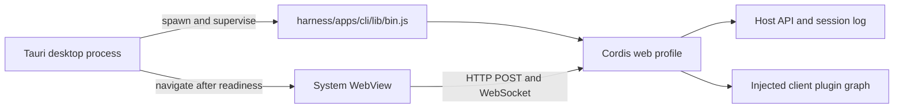

# DeepSeek Harness Desktop

DeepSeek Harness 的 Tauri v2 桌面封装。desktop 仓库直接包含完整的 Harness 源码，桌面层复用现有 Web Client、Typert RPC 与 Cordis profile，不复制 agent loop，也不维护另一套会话实现。

## 目录结构

```text
deepseek-harness-desktop/
├─ harness/          # 由本仓库直接跟踪的完整 DeepSeek Harness 源码
├─ scripts/          # 首次运行准备脚本
├─ src/              # Tauri 启动/错误页
├─ src-tauri/        # Rust 窗口与 Harness 进程监督器
└─ package.json
```

`harness/` 不是 Git 子模块。普通 `git clone` 会直接取得其中的源码，不需要 `--recurse-submodules`，也不依赖另一个相邻仓库。上游地址、导入提交与许可证记录见 [`HARNESS_UPSTREAM.md`](HARNESS_UPSTREAM.md)。

## 架构



- Rust 层默认从仓库内 `harness/` 启动 `apps/cli/lib/bin.js web --host 127.0.0.1 --port 0`，读取 `dsh web:` 就绪行后才导航主窗口。
- WebView 使用 Harness 分配的随机回环端口，因此复用现有 Host fence、`/api` 传输和两条 WebSocket 下行流。
- 关闭窗口或应用时，桌面层回收整个 Node 子进程树。
- 启动页是 desktop 唯一新增的前端；Harness 主界面仍由 `harness/apps/web/dist` 提供。
- `DEEPSEEK_HARNESS_ROOT` 可显式覆盖仓库内源码路径，供临时调试其他 Harness checkout 使用。

## 克隆并运行

前置条件：

- Node.js `^22.19.0 || >=24.0.0`
- pnpm
- Rust stable MSVC toolchain、Microsoft C++ Build Tools 与 WebView2（Windows）

普通克隆即可：

```powershell
git clone https://github.com/WJZ-P/deepseek-harness-desktop.git
cd deepseek-harness-desktop
pnpm install
pnpm tauri dev
```

首次运行时，Tauri 的 `beforeDevCommand` 会调用 `pnpm run harness:prepare`：

1. 校验仓库内 Harness 的关键源码文件；
2. 根据 `harness/pnpm-lock.yaml` 安装依赖；
3. 缺少或落后于源码时构建 Harness CLI 与 Web UI；
4. 启动 Vite，再由 Tauri 启动 Harness Host。

也可以提前单独执行准备流程：

```powershell
pnpm run harness:prepare
```

Vite 开发地址固定为 `http://localhost:821`，HMR 使用端口 `822`。Harness Host 本身继续使用由操作系统分配的随机回环端口，避免和其他软件冲突。

Node.js 不在 GUI 进程可见的 `PATH` 中时，可用 `DSH_DESKTOP_NODE` 指定绝对路径。

## 更新 Harness

`harness/` 是从一个明确上游提交导入的源码快照。更新时应整体导入一个经过确认的上游提交，并在同一改动中更新 [`HARNESS_UPSTREAM.md`](HARNESS_UPSTREAM.md) 的提交号。不要把 `harness/` 改回子模块，也不要提交 `node_modules/`、`lib/` 或 `dist/` 生成物。

更新后至少运行：

```powershell
pnpm run harness:prepare
pnpm run build
cargo test --manifest-path src-tauri/Cargo.toml
cargo check --manifest-path src-tauri/Cargo.toml
pnpm tauri build --no-bundle
```

## GitHub 源码完整性检查

提交或推送前可以确认关键 Harness 源文件确实由 desktop 仓库跟踪：

```powershell
pnpm run harness:verify-source
```

当前检查会报告受跟踪的 Harness 源文件数量，并拒绝 `160000` gitlink、缺失的关键源文件或明显不完整的源码树。`pnpm run check` 也会自动执行这项检查。

## 分发边界

当前源码仓库可以从普通 clone 完整构建并运行。生成的 desktop 可执行文件目前仍依赖 Node.js 和同一次 checkout 中构建出的 Harness JS 产物。制作完全自包含安装包时，需要把 Harness Node 运行时与 JS 产物打成 Tauri sidecar，再配置 `bundle.externalBin`。

## 图标

图标源文件是仓库根目录的 [`app-icon.svg`](app-icon.svg)，当前与 Harness Web UI 的鲸鱼 favicon 保持一致。Tauri 平台图标位于 `src-tauri/icons/`；更新源图后在本目录重新生成：

```powershell
pnpm tauri icon app-icon.svg
```
