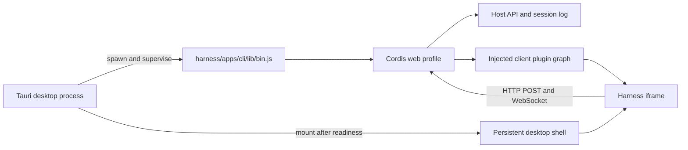

# DeepSeek Harness Desktop

[](https://github.com/WJZ-P/deepseek-harness-desktop/releases)
[](https://github.com/WJZ-P/deepseek-harness-desktop/actions/workflows/release.yml)
[](https://v2.tauri.app/)

**DeepSeek Harness 的轻量跨平台 Tauri 桌面端：使用系统 WebView 而不是随应用捆绑 Chromium，同时内置完整 Harness 运行时。**

desktop 仓库直接包含完整的 Harness 源码，桌面层复用现有 Web Client、Typert RPC 与 Cordis profile，不复制 agent loop，也不维护另一套会话实现。`v1.0.0` 提供 Windows x64、Linux x64、macOS Apple Silicon 与 macOS Intel 构建。

## 轻量 Tauri 实现

- **不捆绑 Chromium。** Windows 使用 WebView2，macOS 使用系统 WKWebView，Linux 使用 WebKitGTK；Tauri 层只负责原生窗口与生命周期。
- **没有第二套业务内核。** Rust 桌面壳仅启动、监督并回收 Harness Host，所有 Agent、会话、工具和插件能力继续由随仓 Harness 源码提供。
- **薄壳、按需运行。** 前端外壳是少量 HTML/CSS/TypeScript 与 Rust 监督代码；生产版首次启动才把压缩的 Harness 运行时展开到应用数据目录，后续直接复用。
- **原生窗口体验。** 32px 自绘标题栏、深浅主题实时同步、无控制台闪窗，并保留 Tauri 的小型原生进程模型。

> 完整发行包会内置 Node.js 与 Harness 生产运行时，因此下载体积主要来自可离线运行的 Harness 后端，而不是浏览器内核。

## 目录结构

```text
deepseek-harness-desktop/
├─ harness/          # 由本仓库直接跟踪的完整 DeepSeek Harness 源码
├─ scripts/          # 首次运行准备脚本
├─ src/              # 持久桌面外壳、自绘标题栏与启动/错误页
├─ src-tauri/        # Rust 窗口与 Harness 进程监督器
└─ package.json
```

`harness/` 不是 Git 子模块。普通 `git clone` 会直接取得其中的源码，不需要 `--recurse-submodules`，也不依赖另一个相邻仓库。上游地址、导入提交与许可证记录见 [`HARNESS_UPSTREAM.md`](HARNESS_UPSTREAM.md)。

## 架构



- Rust 层默认从仓库内 `harness/` 启动 `apps/cli/lib/bin.js web --host 127.0.0.1 --port 0`，读取 `dsh web:` 就绪行后才把随机回环地址交给桌面外壳加载。
- WebView 使用 Harness 分配的随机回环端口，因此复用现有 Host fence、`/api` 传输和两条 WebSocket 下行流。
- 关闭窗口或应用时，桌面层回收整个 Node 子进程树。
- Desktop 外壳使用 32px 原生量级的自绘标题栏；启动阶段跟随 Tauri 窗口主题，Harness 主界面载入后则通过受控主题桥接实时跟随应用内 Appearance 设置。标题栏会持续保留，主界面内容仍由 `harness/apps/web/dist` 提供。
- `DEEPSEEK_HARNESS_ROOT` 可显式覆盖仓库内源码路径，供临时调试其他 Harness checkout 使用。

## 克隆并运行

前置条件：

- Node.js `^22.19.0 || >=24.0.0`
- pnpm
- Rust stable toolchain
- Windows：Microsoft C++ Build Tools 与 WebView2
- macOS：Xcode Command Line Tools
- Linux：WebKitGTK 4.1、Ayatana AppIndicator、RSVG 与 XDO 开发包

普通克隆即可：

```powershell
git clone https://github.com/WJZ-P/deepseek-harness-desktop.git
cd deepseek-harness-desktop
pnpm install
pnpm tauri dev
```

首次运行时，Tauri 的 `beforeDevCommand` 会调用 `pnpm run harness:prepare`：

1. 校验仓库内 Harness 的关键源码文件；
2. 根据 `harness/pnpm-lock.yaml` 安装依赖；
3. 缺少或落后于源码时构建 Harness CLI 与 Web UI；
4. 启动 Vite，再由 Tauri 启动 Harness Host。

也可以提前单独执行准备流程：

```powershell
pnpm run harness:prepare
```

Vite 开发地址固定为 `http://localhost:821`，HMR 使用端口 `822`。Harness Host 本身继续使用由操作系统分配的随机回环端口，避免和其他软件冲突。

Node.js 不在 GUI 进程可见的 `PATH` 中时，可用 `DSH_DESKTOP_NODE` 指定绝对路径。

## 构建平台发行包

在目标操作系统的原生环境中运行：

```bash
pnpm install
pnpm run build
pnpm run verify:release-artifacts
```

构建流程会准备 Harness、生成并校验生产依赖闭包、内置当前平台的 Node.js、执行随机回环端口 HTTP 冒烟，再编译并打包 Tauri 应用。输出与 GitHub Release 保持一致：

| 平台 | Release 资产 |
| --- | --- |
| Windows x64 | `DeepSeek-Harness-Desktop-1.0.0-windows-x64-portable.zip` |
| Linux x64 | `DeepSeek-Harness-Desktop-1.0.0-linux-x64.AppImage`、`.deb` |
| macOS Apple Silicon | `DeepSeek-Harness-Desktop-1.0.0-macos-arm64.dmg` |
| macOS Intel | `DeepSeek-Harness-Desktop-1.0.0-macos-x64.dmg` |

每个资产都附带独立的 `.sha256` 文件。Windows ZIP 解压后可直接双击 `DeepSeek Harness.exe`；`runtime/` 必须与 EXE 保持在同一目录。Linux 与 macOS 的 Node/Harness 运行时作为 Tauri resource 放入原生包内。首次启动会把 Harness 压缩运行时展开到应用本地数据目录，后续复用同一版本缓存。

Windows 还可以执行完整便携版冒烟测试；它会解压 ZIP、直接启动 EXE，确认内置 Node、主题桥、随机回环 HTTP、WebView 连接与进程树回收：

```powershell
pnpm run test:release
```

只构建桌面前端时可运行 `pnpm run build:frontend`；该命令不产生原生发行包。

## GitHub Actions 自动发布

[`release.yml`](.github/workflows/release.yml) 在推送 `v*` tag 时并行使用 Windows x64、Ubuntu 22.04 x64、macOS arm64 与 macOS Intel runner。流水线先校验 tag、`package.json`、Tauri 配置和 Cargo 包版本一致，再分别构建平台包、验证 SHA-256；Windows 额外执行真实 EXE 冒烟测试。所有矩阵任务成功后，独立的 publish job 才会把完整资产集合一次性写入同一个 GitHub Release。

正式版本确认可用后再创建与应用版本一致的 `v*` tag。Release 构建不需要额外密钥；发布权限来自仓库自动提供的 `GITHUB_TOKEN`。

## 更新 Harness

`harness/` 是从一个明确上游提交导入的源码快照。更新时应整体导入一个经过确认的上游提交，并在同一改动中更新 [`HARNESS_UPSTREAM.md`](HARNESS_UPSTREAM.md) 的提交号。不要把 `harness/` 改回子模块，也不要提交 `node_modules/`、`lib/` 或 `dist/` 生成物。

更新后至少运行：

```powershell
pnpm run harness:prepare
pnpm run build:frontend
cargo test --manifest-path src-tauri/Cargo.toml
cargo check --manifest-path src-tauri/Cargo.toml
npm run build
pnpm run test:release
```

## GitHub 源码完整性检查

提交或推送前可以确认关键 Harness 源文件确实由 desktop 仓库跟踪：

```powershell
pnpm run harness:verify-source
```

当前检查会报告受跟踪的 Harness 源文件数量，并拒绝 `160000` gitlink、缺失的关键源文件或明显不完整的源码树。`pnpm run check` 也会自动执行这项检查。

## 分发边界

源码仓库保留完整 `harness/` 供审计与本地开发；各平台资产携带从这些源码构建的生产运行时。Windows 使用无安装 portable ZIP，Linux 提供 AppImage 与 DEB，macOS 提供采用 ad-hoc 签名的 DMG。当前产物未使用商业代码签名或 Apple notarization，因此 Windows SmartScreen 或 macOS 隐私与安全设置可能要求用户额外确认。

## 图标

图标源文件是仓库根目录的 [`app-icon.svg`](app-icon.svg)，当前与 Harness Web UI 的鲸鱼 favicon 保持一致。加载页使用同一条鲸鱼路径；静态浅色与深色版本分别保存在 [`src/assets/whale-icon-light.svg`](src/assets/whale-icon-light.svg) 和 [`src/assets/whale-icon-dark.svg`](src/assets/whale-icon-dark.svg)。深色版本使用 `--dsw-alias-label-primary`，其回退值是 `#F9FAFB` / `rgb(249, 250, 251)`，供后续深色加载页适配使用。

Tauri 平台图标位于 `src-tauri/icons/`；更新源图后在本目录重新生成：

```powershell
pnpm tauri icon app-icon.svg
```
